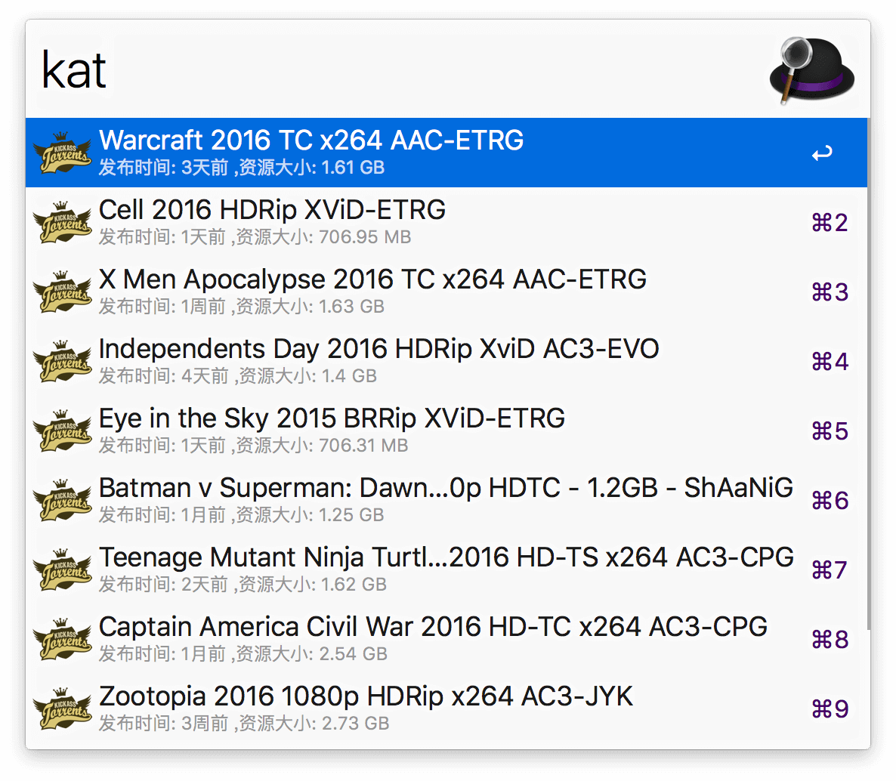

# AlfredWorkflow-Katcr-Movies

 一个快速获取Kat.cr 上热门影视的Alfred Workflow
 
 ****
 
（提醒：**本rep 不再更新**，推荐如下整合版，整合版将保持长期更新：[一个快速获取SubHD、Kat.cr、电影天堂的资源信息列表的Alfred Workflow](https://github.com/Jeff2Ma/AlfredWorkflow-DYHub) ） 
 
## 基本说明

这是一个可以通过Alfred 的关键词快速获取[kat.cr](https://kat.cr/movies/) 电影栏目的热门资源的Alfred Workflow。使用Python 语言编写，支持最新的Alfred 3。

使用本Workflow 前请确保你的Alfred APP 的Powerpack 功能已经解锁。

## 效果预览

 

## 下载地址
 
[点击下载](https://github.com/Jeff2Ma/AlfredWorkflow-Katcr-Moives/blob/master/KAT-Movies.alfredworkflow?raw=true)

## TODO

- 增加Alt 按钮下复制下载链接的功能

- item 的icon 获取为资源封面海报

## 其它

API来源：[https://kat.cr/json.php?q=category:movies](https://kat.cr/json.php?q=category:movies)

小问题：有时候会因为你懂的网络原因抓取失败。

Powered by JeffMa at [DeveWork.com](http://devework.com/)， feel free to use :)

